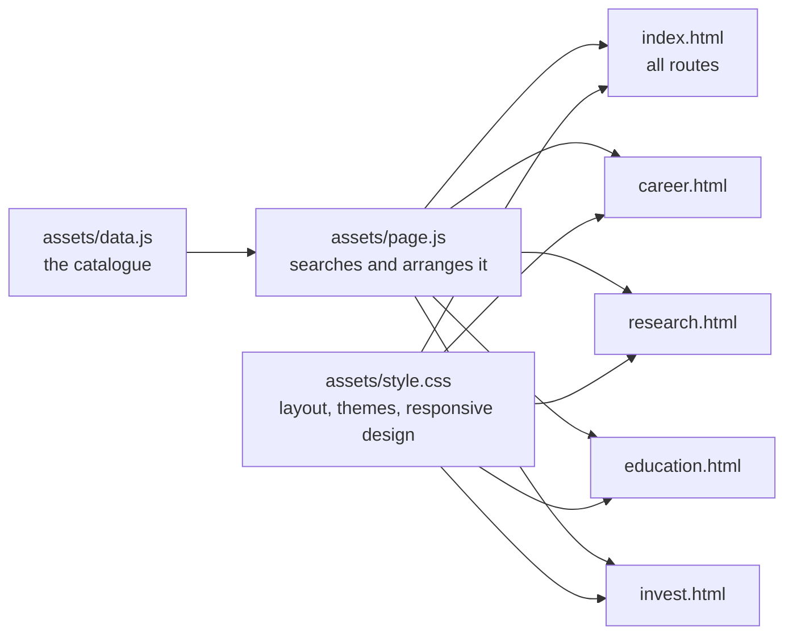

# Climate Resource Hub

A searchable directory for people looking for useful climate work, research, education, and funding resources.

**Live site:** [youngo-science.org](https://youngo-science.org)

## Contents

- [What you can do](#what-you-can-do)
- [How the site works](#how-the-site-works)
- [Run it locally](#run-it-locally)
- [Add a resource](#add-a-resource)
- [Check your changes](#check-your-changes)
- [Deployment](#deployment)
- [Project structure](#project-structure)

## What you can do

The directory contains 109 resources split into four routes:

| Route | What it helps you find | Resources |
| --- | --- | ---: |
| Career | Job boards, climate teams, and ways into the field | 36 |
| Research | Datasets, models, policy tools, and open science | 41 |
| Education | Courses, explainers, teaching material, and communities | 26 |
| Invest | Funds and organizations financing climate solutions | 6 |

Search works across all four routes. It checks every word you type against a resource's name, route, category, description, and website. A search for `solar jobs`, for example, only returns entries that match both `solar` and `jobs`.

On a route page, category buttons narrow the list without losing the recommended “Start here” resources. Search terms also appear in the page URL, so a result can be bookmarked or shared.

The light and dark themes follow the visitor's device by default. The theme button saves a manual choice in the browser.

## How the site works

Think of the project as a library with one catalogue and five entrances:



`assets/data.js` is the source of truth. The HTML files provide page structure and accessible labels. `assets/page.js` reads the data, builds the cards, runs search and filters, and updates result counts. `assets/style.css` gives every page the same visual system.

The resource cards keep each website's favicon so long lists are easier to scan. Those small images are requested from Google's favicon service and lazy-loaded as the cards enter the page.

There is no application server and no database. GitHub Pages serves the files directly.

## Run it locally

Any static file server will work. From the project root:

```bash
python3 -m http.server 4173
```

Then open [http://localhost:4173](http://localhost:4173).

## Add a resource

Add one object to `assets/data.js`:

```js
{
  title: "Climatebase",
  url: "https://climatebase.org/",
  topic: "Career",       // Career | Research | Education | Invest
  subtopic: "General",  // The category shown on the route page
  date: "2026-07-15",
  summary: "A short, concrete explanation of what the visitor will find."
}
```

Use `General` for a resource that should appear in the route's “Start here” section. Keep summaries factual: say what the resource contains and who it is useful for.

## Check your changes

Run the same checks used before deployment:

```bash
node --check assets/data.js
node --check assets/page.js
node scripts/check-site.mjs
```

The site checker catches missing fields, invalid topics, malformed or duplicate URLs, broken page wiring, and accidental removal of the favicons.

## Deployment

Pushing to `main` starts `.github/workflows/deploy-pages.yml`. The workflow validates the site, uploads the repository as a GitHub Pages artifact, and publishes it.

The custom domain is stored in `CNAME`:

```text
youngo-science.org
```

No build command or generated directory is required.

## Project structure

```text
climate-resource-hub/
├── index.html
├── career.html
├── research.html
├── education.html
├── invest.html
├── assets/
│   ├── data.js
│   ├── page.js
│   └── style.css
├── scripts/
│   └── check-site.mjs
├── .github/workflows/deploy-pages.yml
├── CNAME
└── .nojekyll
```

## Contributing

Found a useful resource or a stale link? [Open an issue](https://github.com/unnobatroo/climate-resource-hub/issues/new) or [submit a pull request](https://github.com/unnobatroo/climate-resource-hub/compare).

Curated by [Jaloliddin Ismailov](https://jalols.page) with the YOUNGO Science Working Group.
